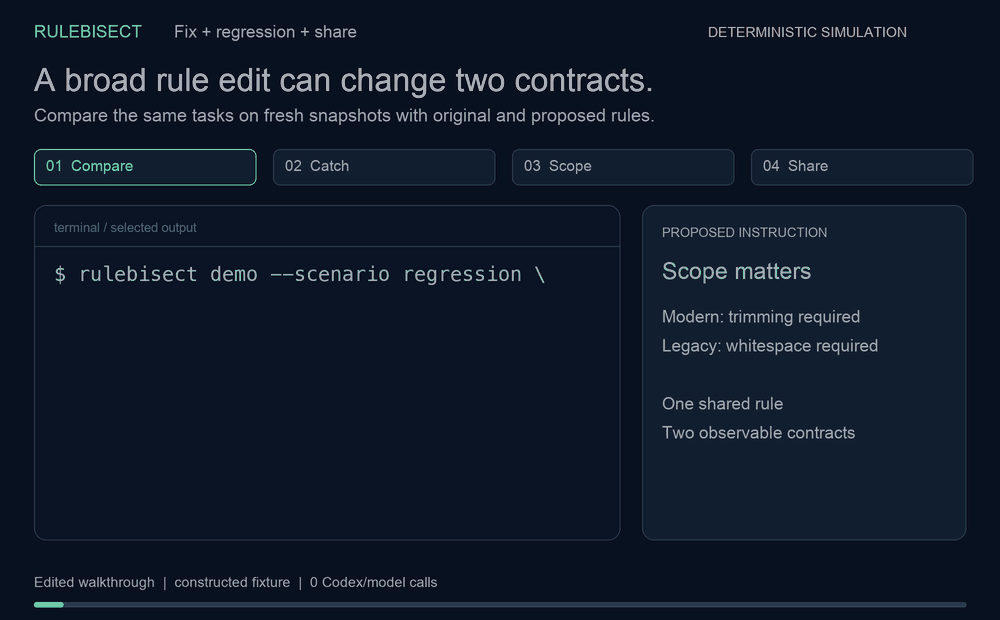
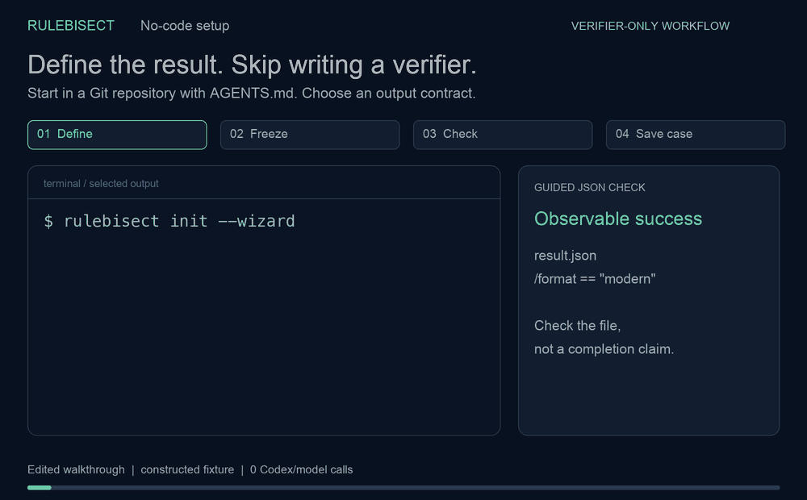
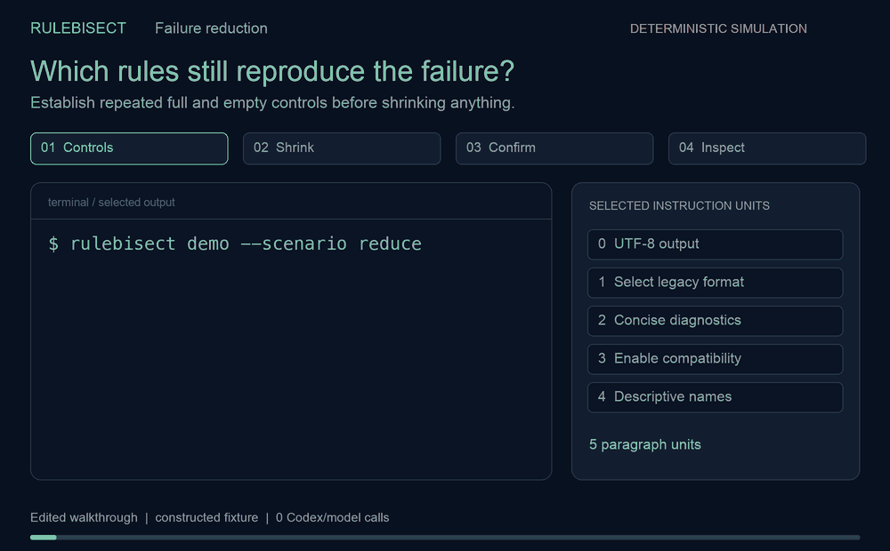

# RuleBisect

**调试 Codex 规则，验证修复有没有破坏其他任务。**

永久免费、MIT 开源、只支持 Codex、无服务端和遥测。真实运行使用**你本机 Codex CLI 的登录身份和账户额度**；项目免费，模型调用仍可能产生费用。当前为实验性工具。

## 看动图了解流程

一条宽泛规则修好了当前任务，却破坏了另一个契约。缩小修改范围，重新检查两种行为，再导出结果摘要：



动图根据**构造的确定性模拟结果**制作并调整阅读节奏，模型调用为零；两次对照演示各执行 8 次模拟。通过只支持这些案例的有限观察。[静态图片](docs/media/regression.png) · [重新生成动图](docs/MEDIA.md)。

<details>
<summary>首次上手：选择 JSON 条件，无需写 Python</summary>



初始输出不存在时，检查会明确显示行为失败；初始化和验证不调用模型。[静态图片](docs/media/onboarding.png)。

</details>

<details>
<summary>失败定位：5 条指令缩减为 2 条失败复现</summary>



48 次**模拟执行**把 5 条指令缩减为 2 条。候选保留了失败，准备修复用 `draft`，验证修改用 `compare`。[静态图片](docs/media/reduction.png)。

</details>

## 先看效果：无需 Codex 账户

按下面步骤安装后，直接运行：

```sh
rulebisect demo --scenario regression --open
rulebisect demo --scenario fix --open
```

第一个演示“新规则修好现代标签，却破坏兼容标签”，第二个展示缩小规则范围后，两种契约都通过。每个演示执行 8 次确定性模拟，**模型调用为零**，报告在本地打开。重复体验自动使用不同输出目录。

演示成功捕获预设回归时退出码为 0；真实 `compare` 发现回归仍返回 2，可以用于阻止错误修改。

选择入口：**调查失败用 `run`，验证修改用 `draft` + `compare`，先体验用 `demo`**。真实任务需要可执行的通过/失败检查。

## 安装并检查自己的仓库

需要 Python 3.11+ 和 Git。真实实验还需安装并登录 Codex CLI。[v0.6.0 发布页](https://github.com/ada-yq225/rulebisect/releases/tag/v0.6.0)提供安装包，项目暂未上架 PyPI。

创建并激活虚拟环境后，可以直接安装发布版：

```sh
python -m pip install https://github.com/ada-yq225/rulebisect/releases/download/v0.6.0/rulebisect-0.6.0-py3-none-any.whl
```

或者从源码安装：

```sh
git clone https://github.com/ada-yq225/rulebisect.git
cd rulebisect
python3 -m venv .venv
# macOS / Linux：
. .venv/bin/activate
# Windows PowerShell 改用：.venv\Scripts\Activate.ps1
python -m pip install .
```

进入你要调查的 Git 仓库，推荐先使用引导式配置：

```sh
rulebisect init --wizard
rulebisect doctor --offline
rulebisect check --all --open
rulebisect run --model 你可用的Codex模型ID --open
```

向导收集具体任务、独立检查、可选的环境准备命令和模型。检查步骤可以输入 `:exists`、`:contains` 或 `:json`，按提示选择文件、文本或 JSON 验收条件；多个条件用 `@checks.json`，已有测试则填检查命令。建议命令需要你明确选择；不会自动安装依赖、执行检查或调用模型。创建后，请审查配置中的指令与保护文件。

### 不写验证脚本，也能检查结果

在自己的仓库中保存 `checks.json`：

```json
[
  {"type": "file_exists", "path": "result.json"},
  {"type": "json_equals", "path": "result.json", "pointer": "/format", "value": "modern"},
  {"type": "file_absent", "path": "debug.log"}
]
```

```sh
rulebisect init --task '创建 result.json，format 为 "modern"，不要生成 debug.log。' --assertions checks.json
rulebisect doctor --offline
rulebisect check --all
# 只有这一步使用你的 Codex 账户：
rulebisect run --model 你可用的Codex模型ID --open
```

初始代码还没有输出文件时，行为失败符合预期。验收条件会固化到独立且受保护的验证器中；之后修改输入 JSON，不会悄悄改变已保存条件。六种检查覆盖文件、文本、正则和 JSON，可用于缩减与修改对照。更多例子见[断言指南](docs/ASSERTIONS.md)和[完整输出契约案例](examples/output-contract)；复杂行为继续使用测试命令或自定义验证器。

也可以继续使用直接配置：

```sh
rulebisect init \
  --task "在 labels.py 中实现 normalize_label，遵循仓库约定" \
  --check "python -m unittest discover -s tests" \
  --model 你可用的Codex模型ID
rulebisect plan
rulebisect check
rulebisect run
```

`init` 自动发现已跟踪的 `AGENTS.md` 和 `AGENTS.override.md`，同目录存在 override 时优先选它；自动生成配置与验证器包装脚本，并把常见命名的测试文件加入保护列表。请检查这些选择是否符合你的任务。未跟踪的根目录指令也会纳入；未跟踪的嵌套指令、Skill 请用 `--instructions` 显式指定。

`plan` 检查快照和配置、显示指令数量与运行上限；`check` 在初始仓库副本里运行验证器。**这两个命令不调用模型。** 初始代码尚未实现时，验证失败可以是预期结果；先查看 `check.log` 确认不是依赖或测试配置错误。

`run` 每次从同一份初始快照开始，输出证据目录，默认放在仓库旁的 `.rulebisect-runs` 里，不会修改原仓库。模型与默认选项保存在 `.rulebisect.json`，之后通常只需 `rulebisect run`。

只想看效果、不想调用模型：

```sh
rulebisect demo --scenario reduce --out ../rulebisect-demo --open
```

这是明确标注的**确定性模拟案例**，不是实际 Codex 效果的证明。

## 调用模型前先排除配置错误

```sh
rulebisect doctor --offline
rulebisect doctor --offline --proposed ../proposed-rules
rulebisect doctor --config experiment.json --json
```

现在 `doctor` 会检查快照输入、指令文件、验证器与保护文件、全部回归用例和预算。加上 `--proposed` 后，也会检查修改后的文件与整个对比所需调用数。无效输入返回退出码 2；未提供 proposed 时，对比预算不足只提示，因为同一配置可能用于缩减实验。

`--offline` 跳过 Codex 安装和登录检查，适合离线准备配置。两种模式都不调用模型、不执行 setup 或验证器，也不生成实验文件。输入检查通过后，用 `check` 实际检查依赖与验证命令。没有保存模型只提示，可在正式运行时用 `--model` 指定。

## 把已有成功任务存成回归用例

```sh
rulebisect case add existing-feature \
  --task "实现已有功能的契约，保持兼容行为" \
  --check "python -m unittest tests.test_existing_feature"
rulebisect case list
rulebisect check --all --open
```

原任务会保留在套件中。新增用例可以用检查命令、`--oracle 现有验证器.py` 或 `--assertions checks.json`；保存时不会执行命令或模型，JSON 条件会固化。配置原子写入，重复 ID 会拒绝；`case remove ID` 只移除条目，保留验证器文件，且不能删除最后一个用例。

`check --all` 在各自独立的初始快照中执行每个 setup 和验证器，汇总成报告，不调用 Codex。退出码 0 表示全部验证器返回 0 或 1，**不等于所有行为都通过**：初始代码尚未实现时，行为失败可以符合预期。环境错误或中断返回 2。部分测试框架也会用 1 表示导入错误，请检查断言和日志。这是在检查本地验证环境，不能证明 Codex 沙箱中的命令可用。

只想先检查少量任务：

```sh
rulebisect compare --proposed ../proposed-rules --cases existing-feature --plan
rulebisect compare --proposed ../proposed-rules --cases existing-feature --open
```

报告会明确列出未检查的用例；局部通过不能代表它们通过。应用共享规则前，请再跑完整套件。详细流程见[中英文快速上手](docs/QUICKSTART.md)。

## 常用功能

| 命令 / 选项 | 用途 | 调用模型 |
|---|---|---|
| `doctor` | 检查 Python、Git、Codex 版本、登录和配置 | 否 |
| `init --wizard` / `init` | 自动生成配置和可信验证器包装脚本 | 否 |
| `inspect` | 阅读拆分后的指令及源文件行号 | 否 |
| `plan` | 检查配置、快照和运行预算 | 否 |
| `check` / `check --all` | 检查单个或全部验证器环境 | 否 |
| `case add/list/remove` | 无需编辑 JSON 管理回归用例 | 否 |
| `run` | 重复运行、删减指令、重新确认 | 是 |
| `resume --from 旧报告目录` | 复用匹配快照的稳定搜索结果，重新运行基线与最终确认 | 是 |
| `draft --out 目录` | 复制指令供修改，保持原仓库规则作为基线 | 否 |
| `compare --proposed 目录` | 对比规则修改前后的任务结果 | 是 |
| `compare --proposed 目录 --plan` | 检查回归用例并显示计划调用数 | 否 |
| `history` | 找回历史实验，不用记报告路径 | 否 |
| `report 报告目录` | 从 JSON 重新生成 HTML / Markdown | 否 |
| `share 报告目录 --out summary.html` | 导出仅含汇总计数的离线分享页 | 否 |
| `--unit-mode section` | 保留标题与段落结构，按标题节缩减 | 随所属命令 |
| `--unit-mode file` | 先定位哪个指令文件值得检查 | 随所属命令 |
| `--max-runs 30` | 限制总调用次数 | 随所属命令 |
| `--max-tokens 100000` | 已上报 Token 达上限后，不再启动下一次调用 | 随所属命令 |

Token 上限不是费用上限；单次调用可能越过它，缺失的用量无法计入。缓存输入已包含在输入 Token 里，不重复相加。不会自动估算金额。

默认每组重复 3 次；允许 `--repeats 2` 做较小实验。预算不足时输出“暂无法判断”，不会省略最终确认而宣称定位成功。

## 继续中断的实验

保持原仓库内容、配置角色、模型、Codex CLI 版本、工具版本、拆分方式、重复次数与超时一致：

```sh
rulebisect resume --from /旧证据目录 --max-runs 100
```

`max-runs` 是**包含旧运行的总次数上限**。续跑生成新的证据目录，保留旧日志；只复用已完成且稳定的搜索组，基线和最终确认会重新执行。快照或关键设置变化时拒绝复用。其他外部环境变化仍可能影响结果，因此复用不能证明整个环境完全一致。

## 报告里有什么

- 中文与英文标注的状态、下一步操作、完整指令与空指令的对照计数。
- 可搜索的指令地图，可只看候选保留的片段。
- 已上报 Token 用量、每次 Agent / 验证器日志和新增、修改和删除文件的代码差异。
- HTML、JSON、Markdown、精简 Issue 草稿、候选指令文件与差异补丁。

补丁只是调查建议，**不会自动应用**。先审查，再在其他任务上验证。代码差异覆盖已快照的非指令文件和未被 Git 忽略的新文件；准备依赖时产生的文件不算新文件证据，较大文件和二进制文件仅记录名称。精简 Issue 草稿默认不包含任务内容、指令正文或原始日志，分享前仍需检查版本等信息。

只想分享结果计数，可以运行：

```sh
rulebisect share ../experiment-evidence --out ../summary.html
```

生成独立、可离线打开的 HTML，只按固定白名单导出状态、来源、计数和已上报 Token；不包含任务、指令、代码、文件名、用例 ID、模型、命令、日志、时间戳或仓库路径。输出必须是证据目录之外的新文件，不会上传。汇总数字也请先审查；摘要不是经过独立认证的证据，也不能代替完整复现材料。[分享说明](docs/SHARING.md)。

## 修改规则后，先验证有没有回退

找出可疑指令之后，还需要确认修改是否修好了问题、有没有影响原来正常的任务：

```sh
rulebisect draft --out ../proposed-rules
# 编辑 ../proposed-rules/AGENTS.md，保留原仓库规则作为基线。
rulebisect compare --proposed ../proposed-rules --plan
rulebisect compare --proposed ../proposed-rules --open
```

单任务无需额外配置，直接复用 `init` 保存的任务和验证器。要保护其他任务，在同一配置中加入：

```json
"cases": [
  {"id": "original-failure"},
  {"id": "working-feature", "task": "实现原来正常功能的行为约定", "oracle": "verify_feature.py"}
]
```

用例继承顶层配置，可单独覆盖 `task`、`oracle`、`verify`、`protected_files`；`id` 只使用字母、数字、下划线和短横线。所有用例的验证器和保护文件都会在每次运行中受到保护，包括未跟踪的验证器。`cases` 仅供 `compare` 使用，`run` 仍缩减顶层单任务。

预算预览显示 **用例数 × 两种规则 × 重复次数**：例如 1 个任务、每组 2 次，需要 4 次调用。次数预算不足会在开始前拒绝；Token 上限按全部用例共享，可能提前停止。原始和拟议规则的运行顺序交替，每次使用同一份初始代码。只替换选定指令文件的内容，不会应用拟议目录的其他代码；须保持文件路径，支持空指令文件。

报告逐任务显示“改善、回退、仍通过、仍失败”，并展示两组已上报 Token 和日志。原始规则稳定通过、拟议规则稳定失败才标为回退；波动、执行异常、中断或预算耗尽不会宣称验证成功。只有拟议规则在所有任务的每次重复中都通过，且原始基线稳定，命令才返回 0；其他情况返回 2，可作为本地或 CI 检查。

**缩减报告的 `candidate/` 是较小的失败复现，不是修复建议。** 请先 `draft`，修改副本，再 `compare`。不要先修改原仓库的规则，否则对照基线也变了。结果是有限观察，不保证其他任务都正常，不自动应用修改。可运行示例：[instruction-regression](examples/instruction-regression)。

## 不用再记报告路径

```sh
rulebisect history
rulebisect report --latest --open
rulebisect resume --latest --max-runs 100
```

历史记录只读取默认 `.rulebisect-runs/<仓库名>` 目录，不调用模型；损坏报告会提示并跳过。最近续跑会排除检查、对照实验、模拟和仍在运行的实验，继续校验快照和版本。使用自定义 `--out` 时仍需指定路径；本版对照实验可重新运行，暂不支持续跑。

## 自动准备依赖

初始化时加上 `--setup "npm ci"`，或在 `.rulebisect.json` 中设置：

```json
"setup": ["{python}", "prepare_environment.py"]
```

每次新建仓库副本后、调用 Codex 前会执行准备命令；`check` 也会执行，因此能先排查环境。支持安装锁定依赖、创建本地虚拟环境等，日志保存在 `setup.log`，超时沿用 `timeout`。命令不通过 shell 执行；多步骤请写进脚本，`{python}` 使用运行 RuleBisect 的解释器。

准备命令失败、超时，或改动了快照文件的内容（包括指令和验证器）时，会在调用模型前停止。生成的依赖建议加入 Git 忽略并安装在副本中。原仓库的已安装依赖仍不会复制，外部服务或依赖版本也不保证固定；续跑要求准备命令一致。工具版本升级后，旧证据可阅读，不能跨版本续跑。

## 准确的验证器

`--check` 接受一条带引号的命令，不支持 shell 管道、重定向或多个命令。它把返回码 0 当作通过、1 当作行为失败、其他返回码当作环境错误。**有些测试框架的导入错误也会返回 1，工具无法自动区分**；需要精确归因时使用独立验证脚本：

```sh
rulebisect init --task "明确的任务" --oracle verify_behavior.py --model 模型ID
```

脚本退出码：**0 通过，1 目标行为失败，2+ 环境或验证器错误**。相对路径基于实验仓库根目录。验证器复制到副本外，修改受保护文件会判为失败；任意导入代码和外部依赖仍需要你信任。测试文件自动保护是命名启发式，请检查并补齐 `protected_files`。

## 结果的边界

完整指令必须反复失败，移除所选指令后必须反复通过，才开始缩减。最终候选再次反复失败，每个逐条移除的对照反复通过，才标为 `observed_1_minimal`。

这是有限次数的观察，不保证全局最小、不证明语义冲突或因果关系、不声称统计显著。遇到波动或执行异常会停止。默认按段落拆分；删除标题可能改变文档结构，必要时先用 `section` / `file` 模式。工具不确认每个片段是否实际加载，不复现全部外部上下文。

快照包含已跟踪文件的当前内容（包括未提交修改），以及显式指定的指令、验证器和保护文件。其他未跟踪/忽略文件、Git 历史、安装的依赖不复制；暂不支持符号链接、子模块。仓库副本不是容器或安全边界，仅运行可信仓库和验证命令。原始日志、代码差异和完整报告可能含私有代码，分享前检查。

本轮功能选择依据和公开需求来源：[需求记录](docs/DEMAND.md)、[创新性与竞品核对](docs/INNOVATION.md)。

## 开发与贡献

```sh
python3.11 -m unittest discover -s tests -v
```

当前已测试实际 Python 函数修改、确定性缩减、断点续跑、快照变化拒绝、Token 停止和无模型配置流程。准确结果见 [VALIDATION.md](VALIDATION.md)。v0.2 已通过 Linux/macOS/Windows 的 Python 3.11/3.13 六组 GitHub CI；新版验证记录见上述文档。

最有价值的贡献是可脱敏、可独立验证的真实失败案例。附模型和工具版本、任务、指令、验证条件与重复运行次数。

相关方法已有 [LLM Delta Debugging](https://www.amazon.science/publications/delta-debugging-for-llm-integrated-systems) 和 [skill-eval-harness](https://github.com/adewale/skill-eval-harness)。本项目探索从仓库失败任务得到更小指令组合和本地证据的工作流，不宣称全球首创。

参与开发或提交可复现案例：[贡献指南](CONTRIBUTING.md)。不需要模型账户就能运行完整自动化测试和演示。
